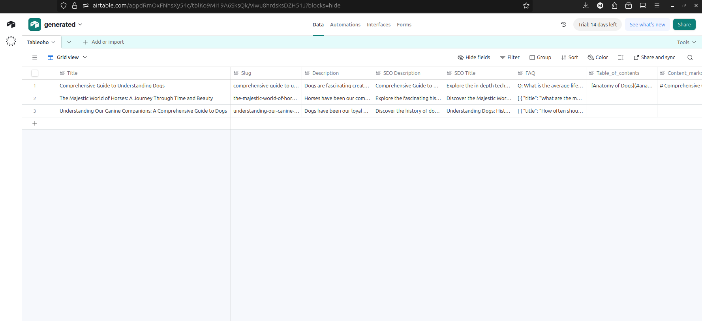

# AI Blog Post Generator


An automated content generation service that uses OpenAI to create complete, structured blog posts from a simple topic or brief. The output is provided in a structured JSON format and can be optionally saved to Airtable.

## Overview

This project directly fulfills the requirements of the initial brief: to create a lightweight automation that uses AI to generate blog post content (text-only) and store the results. It is built as a robust API service using FastAPI and LangChain, containerized with Docker for easy deployment and testing.

The core functionality is to accept a topic, generate a high-quality article with multiple components (SEO metadata, FAQ, etc.), and provide the output in a structured format. The service always saves generated content to a local CSV file and can optionally integrate with an Airtable base if credentials are provided.

## Features

-   **AI-Powered Content:** Leverages OpenAI's models via LangChain for high-quality content generation.
-   **Structured Output:** Returns a detailed JSON object containing the title, slug, description, Markdown content, auto-generated Table of Contents, SEO metadata, and a FAQ section.
-   **Customizable Style:** Allows users to specify the tone and style of the generated article.
-   **Dual Storage System:**
    -   **CSV:** Automatically saves every generated post to a downloadable `.csv` file.
    -   **Optional Airtable Integration:** If credentials are provided, the service will also create a new record in a specified Airtable base.
-   **Multiple Testing Methods:** The service can be tested via a simple web UI, the interactive Swagger API documentation, or direct API requests.
-   **Containerized & Portable:** Fully containerized with Docker for a simple, two-command setup.

## Airtable Integration Proof

The following image shows a new record being successfully created in an Airtable base after a post was generated by the service.



## Core Technologies

-   **Backend:** Python 3.12, FastAPI, LangChain, Pydantic
-   **AI:** OpenAI API
-   **Storage:** CSV, Airtable
-   **Deployment:** Docker
-   **Frontend:** HTML, CSS, JavaScript

---

## Setup and Installation

### Prerequisites

-   Python 3.12
-   Docker


### 1. Clone the Repository

1.1 First, clone the project repository to your local machine.
```bash
git clone https://github.com/Mrhetsko/ai_reporter.git
```
1.2 Navigate into the project directory:
```bash
cd ai_reporter
```

### Configuration (`.env` file)

All configuration is handled through an environment file. The project includes a `.env.example` file to show the required structure. You must create your own `.env` file in the project root.

1.  **Create the `.env` file:**
    You can do this easily by copying the template:
    ```bash
    cp .env.example .env
    ```

2.  **Edit the `.env` file:**
    Open the `.env` file in a text editor.
    -   The `OPENAI_API_KEY` is **required**. The application will not work without it.
    -   The `AIRTABLE_...` variables are **optional**. If you want to test the Airtable integration, fill in your credentials. Otherwise, the application will safely ignore them.

    ```dotenv
    # .env file

    # --- Required Variables ---
    OPENAI_API_KEY="your_openai_api_key_here"

    # --- Optional Variables for Airtable Integration ---
    # AIRTABLE_API_KEY="pat..."
    # AIRTABLE_BASE_ID="app..."
    # AIRTABLE_TABLE_ID="tbl..."
    ```

---

## How to Run the Application

You can run this project using either Docker (recommended for simplicity) or a local Python environment.

### Method 1: Running with Docker (Recommended)

This is the easiest and most reliable way to run the service.

1.  **Build the Docker Image:**
    From the project's root directory, execute the following command. This will build the Docker image and tag it as `blog-generator`.
    ```bash
    docker build -t blog-generator .
    ```

2.  **Run the Docker Container:**
    Run the container using the `.env` file you created. The `--env-file` flag tells Docker to load all your secret keys from that file.
    ```bash
    docker run -p 8000:8000 --name blog-generator-app --env-file ./.env -d blog-generator
    ```
    *(The `-d` flag runs it in detached mode. You can omit it to see live logs by running `docker logs -f blog-generator-app`.)*

3.  **Access the Application:**
    The service is now running and accessible in multiple ways:
    -   **Web Interface:** Open your browser and go to **[http://localhost:8000](http://localhost:8000)** to use the main UI.
    -   **API Docs:** Test endpoints interactively via Swagger UI at **[http://localhost:8000/docs](http://localhost:8000/docs)**.
    -   **Direct API Requests:** Send requests from any HTTP client (like cURL or Postman) to the API endpoints.

4.  **Stopping the Service:**
    To stop and remove the container, run the following commands:
    ```bash
    docker stop blog-generator-app
    docker rm blog-generator-app
    ```

### Method 2: Running Locally with Python (Without Docker)

1.  **Create a Virtual Environment:**
    ```bash
    python3.12 -m venv venv
    ```

2.  **Activate the Environment:**
    -   On macOS/Linux: `source venv/bin/activate`
    -   On Windows: `.\venv\Scripts\activate`

3.  **Install Dependencies:**
    ```bash
    pip install -r requirements.txt
    ```

4.  **Run the Application:**
    From the project's **root directory**, run the Uvicorn server. It will automatically load the `.env` file.
    ```bash
    uvicorn backend.app.main:app --reload --host 0.0.0.0 --port 8000
    ```

5.  **Access the Application:**
    Open your browser and go to **[http://localhost:8000](http://localhost:8000)**.

---

## How to Use & Test the Service (Detailed)

You can test the functionality in three ways:

#### 1. Via the Web Interface (Recommended)

Navigate to **[http://localhost:8000](http://localhost:8000)**. Fill in the topic, select a style, and click "Generate Post". The full, structured article will be displayed on the page. A "Download CSV" button will appear after the first successful generation.

#### 2. Via the API Documentation (Swagger UI)

Navigate to **[http://localhost:8000/docs](http://localhost:8000/docs)** to access the interactive API documentation. You can test all endpoints directly from this interface.

-   Use the `POST /api/generate-blog-post` endpoint to create a new article.

#### 3. Via a Direct API Request (e.g., cURL)

You can send a `POST` request to the API endpoint using any HTTP client.

```bash
curl -X POST "http://localhost:8000/api/generate-blog-post" \
-H "Content-Type: application/json" \
-d '{
  "topic": "The benefits of using FastAPI for modern web APIs",
  "style": "technical and informative"
}'